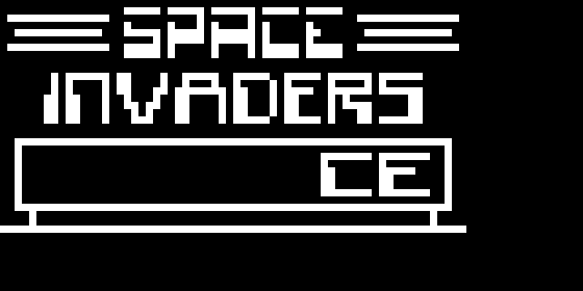

Rust Chip-8 Emulator
==========

A simple Chip-8 emulator, done as a weekend project to learn Rust.

## What is Chip-8?

Chip-8 was never a real in-hardware system, instead it's a simple programming language that can be run on any system with a properly implemented virtual machine.  It was first used in the 70s and 80s on early computers like the [COSMAC VIP](http://en.wikipedia.org/wiki/COSMAC_VIP), [DREAM 6800](http://www.mjbauer.biz/DREAM6800.htm) and other DIY machines.  Later in the 90s it regained some popularity as an easy way to program games on graphing calculators like the HP48 (and who didn't try and program games on their graphing calculator?  Thankfully it was easier for my generation poking at the TI89).

See [CowGod's Chip-8 Technical Reference](http://devernay.free.fr/hacks/chip8/C8TECH10.HTM) and [Chip-8 on Wikipedia](http://en.wikipedia.org/wiki/CHIP-8) for more details.

## Building

This is easy to build using [Cargo](cargo.io), Rust's package manager.  Just install Cargo as per the instructions on the website, clone the repo and run:

    cargo build --release
    
Note that Rust is still in a pre-1.0 state and breaking changes may be made that will cause the code in this repo not to compile.  You can safely assume that it built against the nightly Rust build on the date of the last commit.  If you come across anything broken, I'll happily accept PRs.  Additionally while this _should_ work on Windows, it's only been tested on Ubuntu Linux 14.04.

You can also run the test suite with:

    cargo test

## Running

To run, you'll need to first source some Chip-8 ROMs - there are quite a few available in the "program pack" hosted by [Chip8.com](http://chip8.com/).  Then just specify the path to your ROM on the command line:

    target/rustychip8 -f ~/chip8roms/PONG
    
Once it's up and running you can interact with the program via the Chip-8 keypad, which is mapped onto a normal QWERTY keyboard as shown below:

| 1 | 2 | 3 | C |    | 1 | 2 | 3 | 4 |
|---|---|---|---|----|---|---|---|---|
| 4 | 5 | 6 | D | to | Q | W | E | R |
| 7 | 8 | 9 | E |    | A | S | D | F |
| A | 0 | B | F |    | Z | X | C | V |
    
## Task List

* [x] Implement main fetch/decode/execute loop with support for all instructions.
* [x] Add rendering of the graphics buffer
* [x] Add keyboard input
* [ ] Testing with various public domain ROMs

